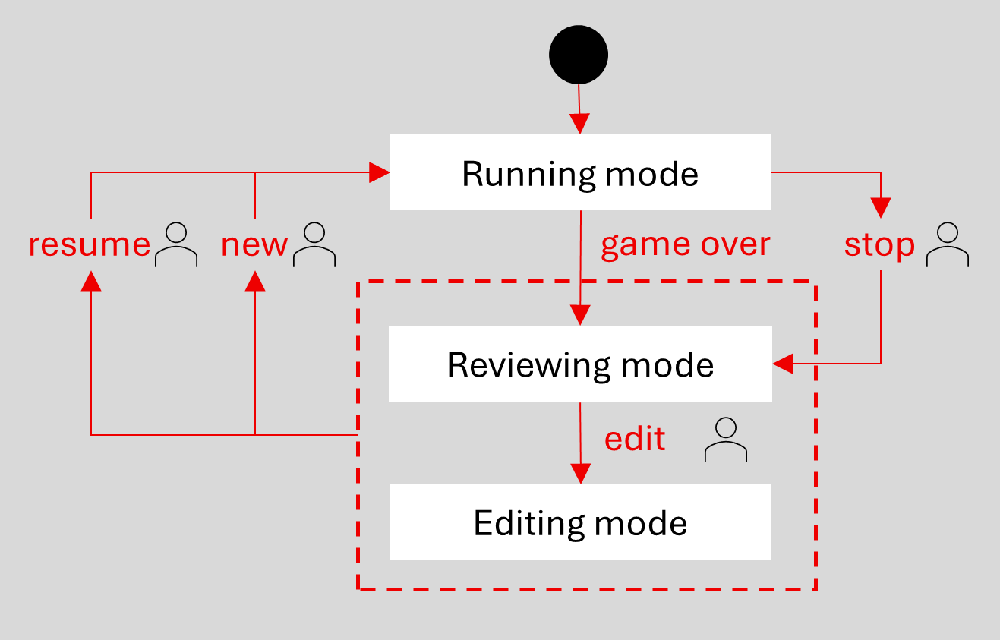
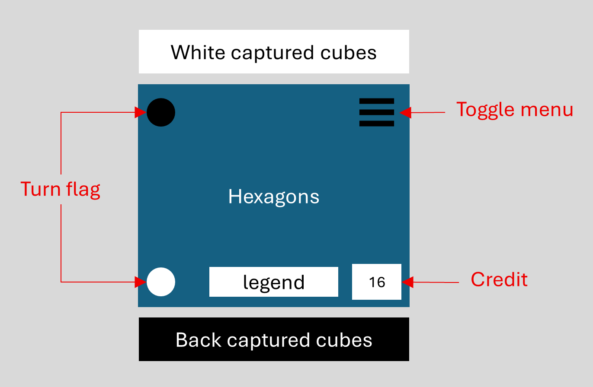
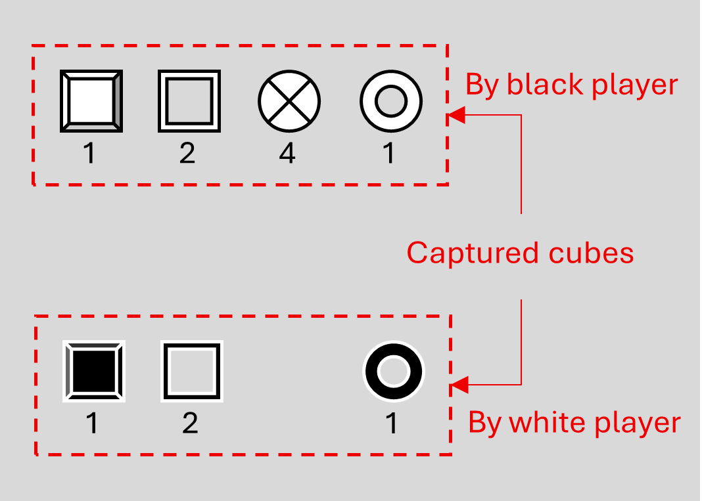
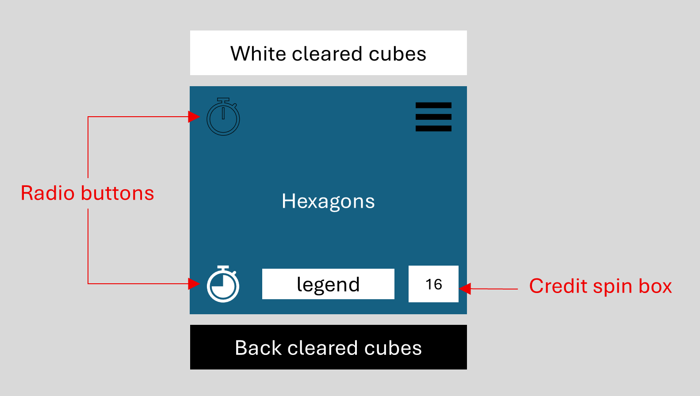
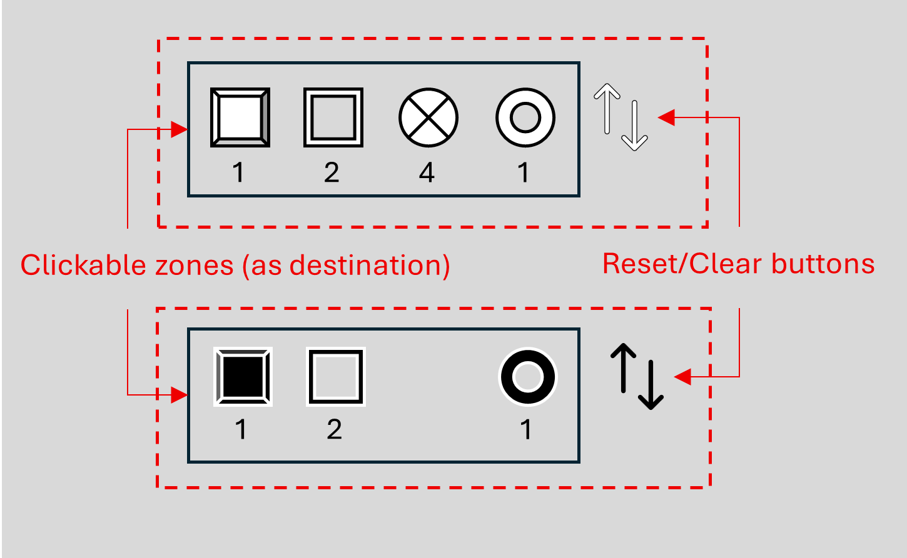
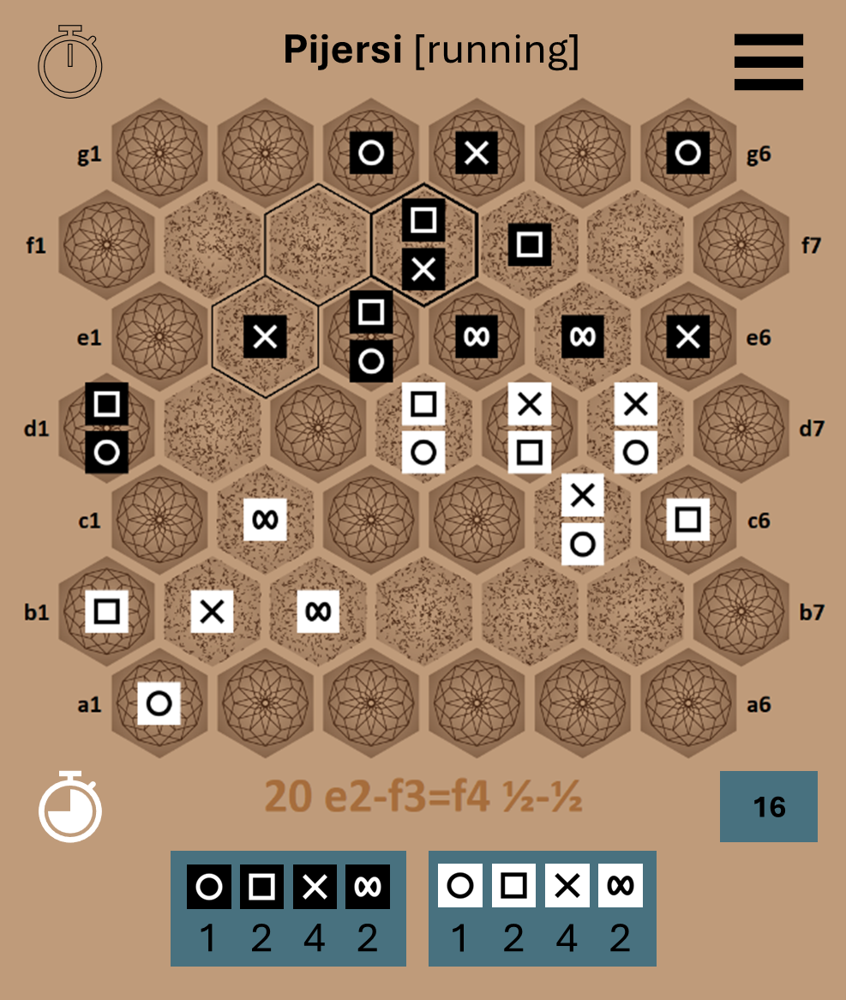
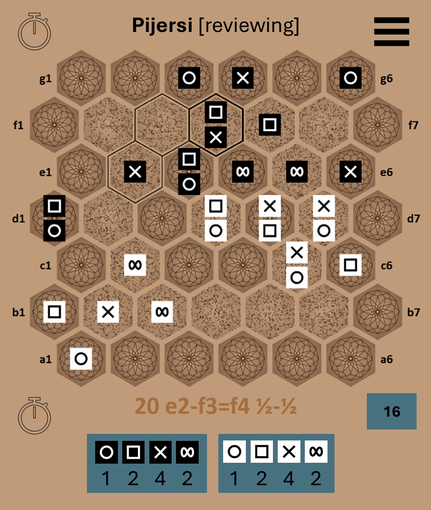
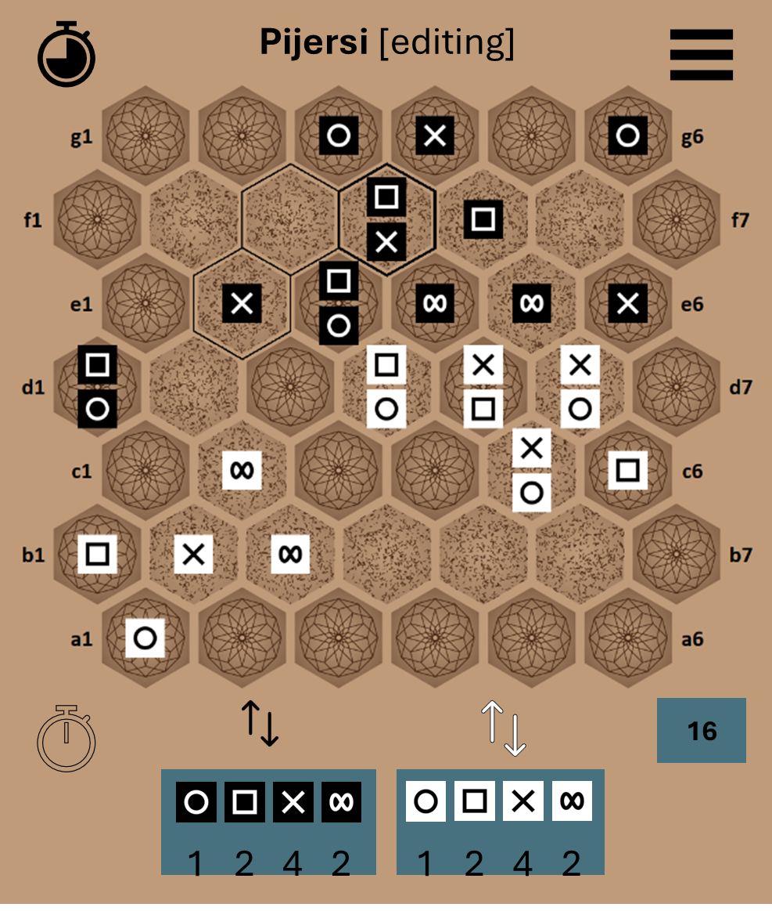
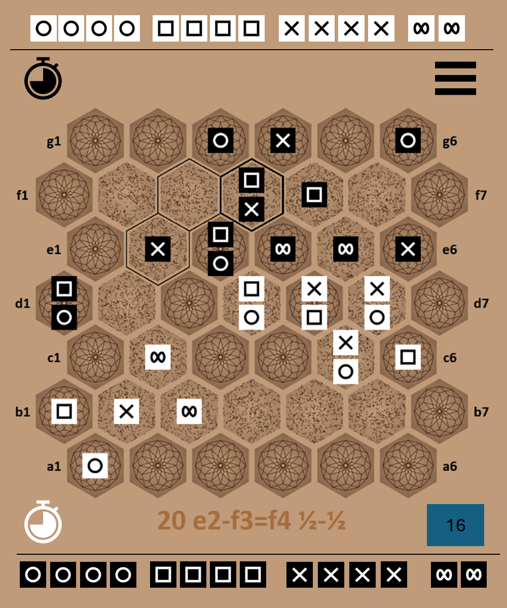

# DESIGN

## Modes

- Running a game
- Reviewing a game:
  - move back and forth amongst the played moves
  - resume the game from the displayed move
- Editing a game
  - reset to standard positions, initial turn player and credit counter
  - remove all cube from the board
  - freely select, remove, move and stack any cube, respecting the stacking rules.
  - set the player turn
  - set the credit counter

Transitions between modes are triggered either by events or user actions, as depicted in the following schema:

## General layout

The following layout should be convenient for a desktop browser and a smart-phone screen (the sketch of a realistic layout may change a bit such symbolic layout ; see next sections in the document).

Hereafter is a detail on the layout of the "captured cubes" zones -- when a kind of cube is no capture, then the picture of that kind is not displayed:

## Editing mode layout

Hereafter some passive items becomes active for changing the active player and the credit counter:

As depicted hereafter, one reset/clear button appears in each captured/cleared cubes zone : either all cubes are removed out of the board or the cubes are reset to their standard position.

## Realistic layouts

### Option with compact and bottom capture zones

This is preferred over the top and bottom capture zones showed after.

### Option with top and bottom capture zones

This is disturbing and unusual !

