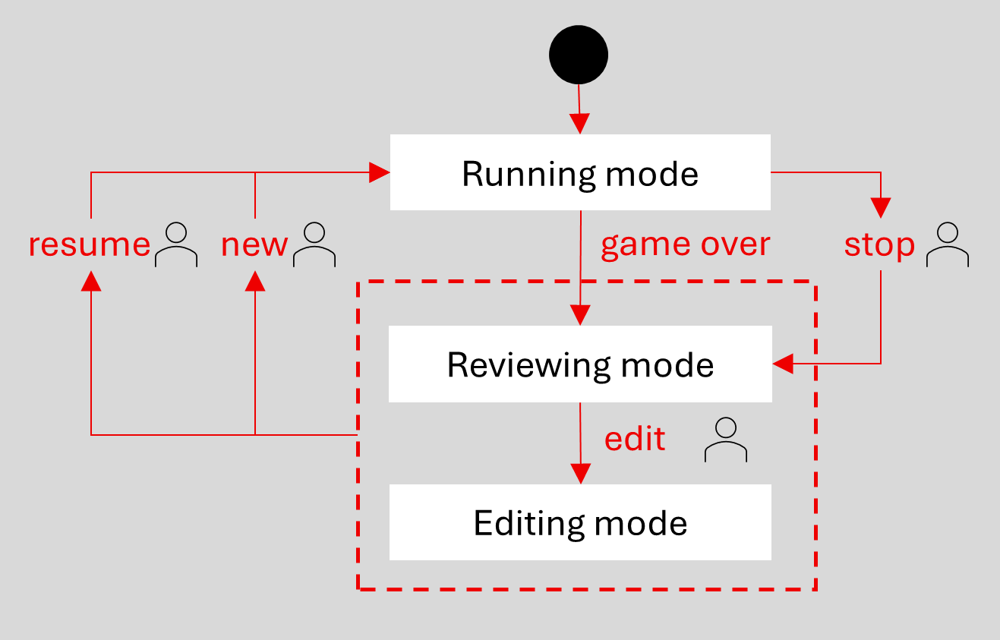

# pijersi-js

This repository implements the **Pijersi** boardgame for a web browser using JS, CSS and HTML.

The rules of Pijersi are explained here [https://github.com/LucasBorboleta/pijersi](https://github.com/LucasBorboleta/pijersi) in a rulebook (Markdown and PDF formats) and also here in videos in  [English](https://youtu.be/w2c6-h2DAus) or in  [French](https://youtu.be/w41zrhBB5t8) (both with subtitles).

If you intent to derive or to sell either a text, a product or a software from this work, then read the [LICENSE](./LICENSE.txt) and the  [COPYRIGHT](./COPYRIGHT.md)  documents.

The work is in progress : it is the design phase !

